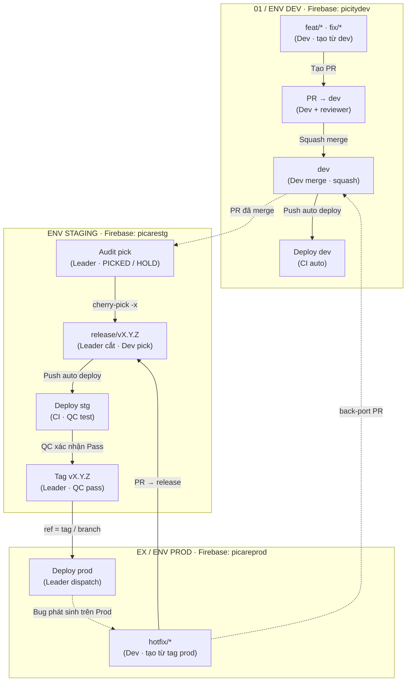

# PiCare Git Workflow & Release Management

Tài liệu đặc tả toàn diện và hướng dẫn vận hành quy trình Git Workflow cho hệ thống **PiCare**, tích hợp cơ chế **Audit Pick Gate** và triển khai 3 môi trường Firebase tương ứng: **DEV** (`picitydev`), **STAGING** (`picarestg`), và **PROD** (`picareprod`).

---

## 1. Kiến trúc Workflow tổng thể



---

## 2. Ma trận Môi trường ↔ Nhánh Git

| Môi trường | Dự án Firebase | Nhánh kích hoạt | Cơ chế triển khai | Mục đích |
|---|---|---|---|---|
| **01 / DEV** | `picitydev` | `dev` | CI tự động khi push/merge | Phát triển tính năng liên tục, test nội bộ Dev |
| **STAGING** | `picarestg` | `release/vX.Y.Z` | CI tự động khi push | QC kiểm thử toàn diện đợt phát hành, UAT |
| **PROD** | `picareprod` | Tag `vX.Y.Z` / Release branch | **Chỉ** Leader kích hoạt (Manual Dispatch, environment `production` có thể bật Required reviewers). Không auto theo tag push. | Triển khai chính thức cho người dùng cuối |

---

## 3. Phân định vai trò & trách nhiệm

### 3.1. Developer (Phát triển)
- Tạo nhánh làm việc `feat/*`, `fix/*` từ `dev`.
- Mở PR vào nhánh `dev`, tuân thủ format PR template (ghi rõ số hiệu Issue).
- Sau khi được approve, thực hiện **Squash Merge** vào `dev`.
- Hỗ trợ cherry-pick các PR của mình vào nhánh release khi Leader yêu cầu (`scripts/release/pick-to-release.sh`).
- Khi có sự cố Prod: tạo nhánh `hotfix/*` từ **tag prod**, sửa lỗi và mở 2 PR:
  1. PR vào nhánh release hiện tại (để QC test staging).
  2. PR (back-port) vào nhánh `dev` (để tránh thất lạc mã nguồn).

### 3.2. QC (Kiểm thử)
- Kiểm thử ban đầu trên môi trường Dev (`picitydev`).
- Kiểm thử chuyên sâu, nghiệm thu tính năng và regression test trên môi trường Staging (`picarestg`).
- Ký duyệt (Sign-off / Pass) đợt phát hành để Leader tiến hành đóng Tag.

### 3.3. Leader (Quản lý phát hành)
- Cắt nhánh release `release/vX.Y.Z`.
- Chạy kiểm tra **Audit Pick Gate** định kỳ và trước khi đóng Tag.
- Quyết định trạng thái của từng PR: **PICKED** (đưa vào release) hoặc **HOLD** (tạm hoãn đợt sau).
- Tuyệt đối không đóng Tag hay Deploy Prod nếu còn PR ở trạng thái **UNKNOWN**.
- Đóng Tag `vX.Y.Z` và kích hoạt GitHub Action deploy Firebase Prod (`picareprod`).

---

## 4. Quy tắc cắt Release & Hotfix

1. **Cắt nhánh Release (`release/vX.Y.Z`)**:
   - **Lần 1**: Cắt từ nhánh `dev`.
   - **Lần 2+**: Cắt từ **latest tag prod** (ví dụ `v1.1.2`).
   - Chỉ cắt đợt tiếp theo sau khi đợt trước đã lên Prod thành công.
2. **Hotfix (`hotfix/*`)**:
   - Luôn luôn rẽ nhánh từ **tag prod** đang chạy thực tế.
   - Khi hoàn thành: tạo PR vào nhánh `release` (QC verify) VÀ PR backport vào `dev`.

---

## 5. Cơ chế Audit Pick Gate (Trước khi Tag)

### 5.1. Định nghĩa tập quét
Tập quét audit là tất cả các commit/PR đã merge vào `dev` kể từ điểm phân nhánh của release:
$$\text{Range} = \text{merge-base}(\text{release}, \text{dev})\dots\text{dev}$$

### 5.2. Các trạng thái PR
| Trạng thái | Điều kiện nhận diện | Xử lý |
|---|---|---|
| **PICKED** | Có trailer `(cherry picked from commit <sha>)` trên nhánh release, hoặc patch tương đương qua `git cherry`. | Đã an toàn, không cần làm gì. |
| **HOLD** | PR có gắn nhãn GitHub `hold:vX.Y.Z` (gắn bằng `scripts/release/hold-pr.sh`; sang đợt sau tự trở thành UNKNOWN buộc phải duyệt lại). | Tạm hoãn, không cần làm gì trong đợt này. |
| **UNKNOWN** | Các PR còn lại (chưa được pick và chưa được gắn hold). | **Chặn Release!** Leader phải pick hoặc gắn hold. |

### 5.3. Quy tắc mặc định khi duyệt PR
- **chore / refactor codebase**: Pick hết, pick sớm. Tránh để tích tụ gây xung đột merge (merge conflicts) phức tạp về sau.
- **fix có linked issue**: Pick khi issue đã được QC xác nhận (verified) trên dev.
- **feat (tính năng mới)**: PM duyệt theo scope đợt. Nếu chưa ra đợt này thì gắn nhãn `hold:vX.Y.Z`.
- **vặt (typo, tài liệu docs)**: Pick hết.

---

## 6. Sổ tay lệnh thực thi (CLI Cheat Sheet)

### Cắt release mới:
```bash
# Tự động nhận diện lần 1 (từ dev) hoặc lần 2+ (từ tag prod gần nhất)
bash scripts/release/cut-release.sh v1.2.0
```

### Chạy Audit Pick Gate:
```bash
# Xem dạng bảng màu terminal
bash scripts/release/audit-pick.sh release/v1.2.0

# Xuất Markdown (cho GitHub Step Summary / Issue tracking / Orca Artifact)
bash scripts/release/audit-pick.sh release/v1.2.0 --md
```

### Pick PR vào release:
```bash
# Nhận PR number hoặc commit SHA. Chặn PR chưa merge dev, bỏ qua PR đã pick,
# tự sắp theo thứ tự merge trên dev. KHÔNG push — xem lại rồi git push.
bash scripts/release/pick-to-release.sh release/v1.2.0 3892 3916 3940
git push origin release/v1.2.0
```

### Hoãn PR sang đợt sau:
```bash
# Tạo nhãn hold:v1.2.0 nếu chưa có rồi gắn lên PR
bash scripts/release/hold-pr.sh v1.2.0 3925
```

### Đóng Tag phát hành (Có tự động kiểm tra Audit Gate):
```bash
# Từ chối nếu còn PR UNKNOWN hoặc nhánh release local chưa push (khác origin).
bash scripts/release/tag-release.sh release/v1.2.0 "Release v1.2.0"
git push origin v1.2.0
# rồi Leader chạy workflow "EX / ENV PROD" với release_ref = v1.2.0
```

### Tạo nhánh Hotfix từ tag prod:
```bash
bash scripts/release/create-hotfix.sh fix-auth-login v1.2.0
```

### Chạy kịch bản mô phỏng toàn diện / test matrix:
```bash
npm run demo:simulate    # walkthrough có giải thích
npm run test:workflow    # 10 test case có assertion (exit 1 nếu sai)
```
